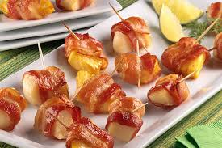
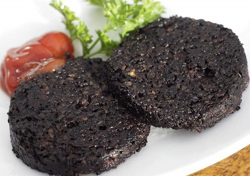
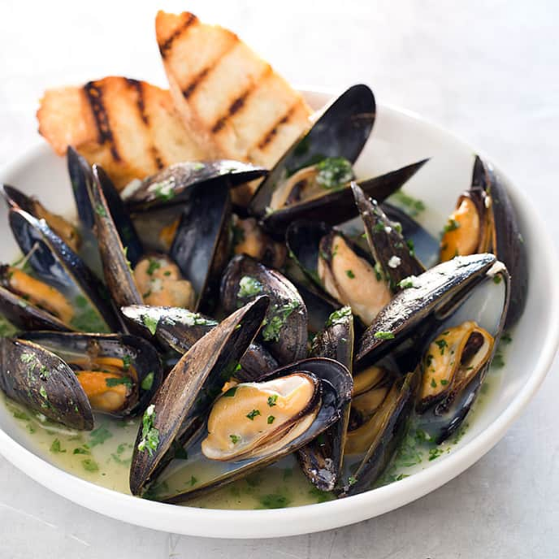
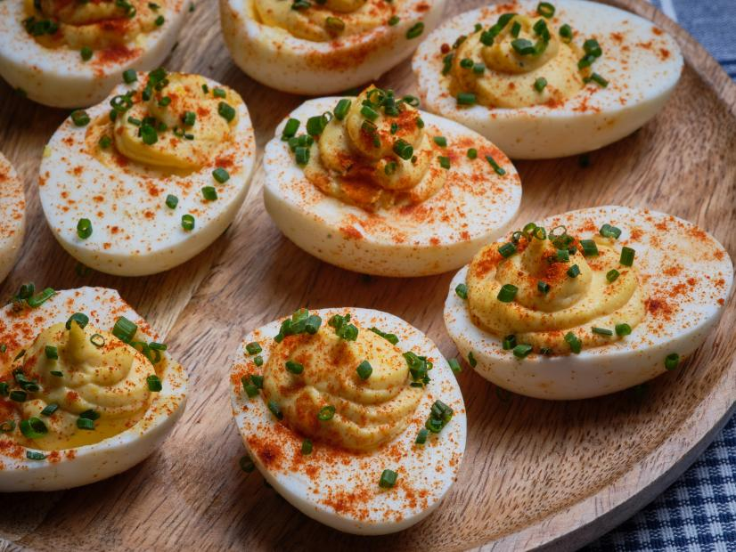
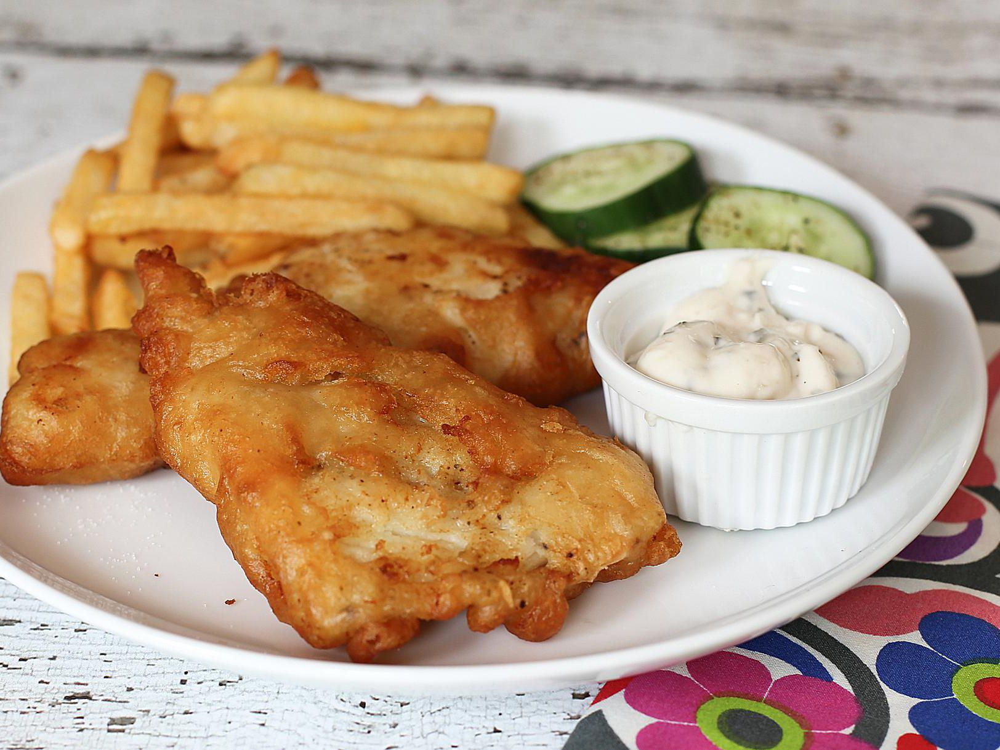

# 期中作業
<link rel="stylesheet" href="topsidenav.css">
此段引用資料夾內的topsidenav.css
---
            <button href="javascript:void(0)" class="closebtn" onclick="closeNav()">&times;</button>
            <button type="button" onclick="Test1()">創始理念</button>
            <button type="button" onclick="Test2()">餐廳設計</button>
            <button type="button" onclick="Test3()">旗下餐廳</button>
            <button type="button" onclick="Test4()">回饋與建議</button>

                
上兩段程式碼是互相配合著使用。
---
        

            <a href="#home" class="active" onclick="openNav()">&#9776; 介紹</button>
            <a href="midTest3.html">開胃菜</a>
            <a href="midTest4.html">主餐</a>
            <a href="midTest5.html">甜點</a>
            
        

        此段程式碼是以連結的方式去開啟，原本打算以button+js的方式不換頁只換內容的方式去寫。
---
            <table>
                <tr>
                  <th colspan="2">開胃菜</th>
                </tr>
                <tr>
                  <td>一口培根</td>
                  <td>黑布丁</td>
                </tr>
                <tr>
                  <td>($15)</td>
                  <td>($30)</td>
                </tr>
                <tr>
                    <td>淡菜</td>
                    <td>惡魔蛋</td>
                  </tr>
                  <tr>
                    <td>($60)</td>
                    <td>($50)</td>
                  </tr>
                  <tr>
                    <td>炸魚排</td>
                    <td>生菜沙拉</td>
                  </tr>
                  <tr>
                    <td>($50)</td>
                    <td>($65)</td>
                  </tr>
              </table>
              
              此段程式碼是以表格內放入圖片去模擬，一般實體菜單的模樣。
---
互聯連結：

  * [連結1](https://github.com/JesusDick/wp108b/blob/master/homework/midTest/midTest2.html)
  * [連結2](https://github.com/JesusDick/wp108b/blob/master/homework/midTest/midTest3.html)
  * [連結3](https://github.com/JesusDick/wp108b/blob/master/homework/midTest/midTest4.html)
  *[連結4](https://github.com/JesusDick/wp108b/blob/master/homework/midTest/midTest5.html)
  *[此連結沒有用到](https://github.com/JesusDick/wp108b/blob/master/homework/midTest/mid-Test.html)

[我的期中網站](https://jesusdick.github.io/wp108b/homework/midTest/midTest2.html)
